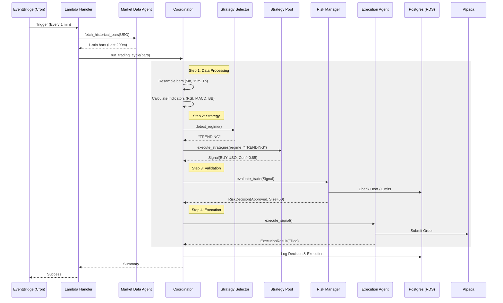
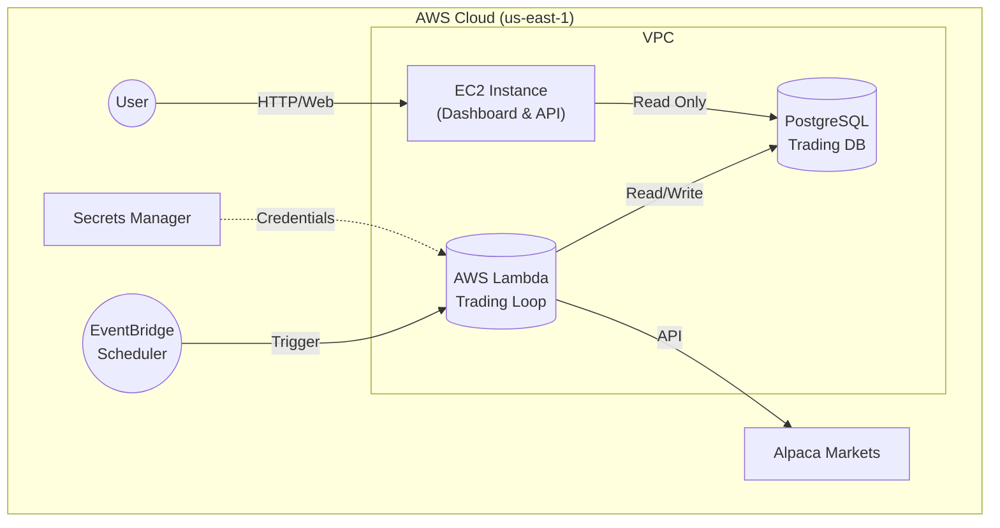

# Quantum Terminal: System Architecture Guide

> **Status:** Production-Ready (Paper/Live Capable)
> **Last Updated:** January 14, 2026

This document provides a comprehensive technical deep-dive into the **Agentic Commodity Trading System**. It details the multi-agent architecture, cloud infrastructure, data flows, and state management strategies used to trade Crude Oil (USO) and Natural Gas (UNG).

---

## 1. System Overview

**Quantum Terminal** is an event-driven, serverless algorithmic trading platform designed for:
*   **High Availability:** Runs on AWS Lambda with 99.9% uptime.
*   **Safety:** Implements a 7-layer circuit breaker system.
*   **Auditability:** Every decision, risk check, and execution is logged to PostgreSQL.
*   **Modularity:** Logic is split across 7 specialized AI agents.

### Tech Stack
*   **Language:** Python 3.12+ (Type-hinted, AsyncIO)
*   **Backend API:** FastAPI (running on EC2)
*   **Trading Engine:** AWS Lambda (Docker Container)
*   **Frontend:** Next.js 14 + Tailwind CSS (running on EC2)
*   **Database:** AWS RDS (PostgreSQL 15)
*   **Cache:** AWS ElastiCache (Redis 7) - *Optional path for Lambda*
*   **Scheduler:** Amazon EventBridge (1-minute intervals)
*   **Broker:** Alpaca Markets (Paper/Live API)

---

## 2. Agentic Architecture Deep Dive

The core intelligence resides in a **Multi-Agent Orchestration** pattern. Agents are stateless, deterministic, and communicate via structured data objects.

### 1. Market Data Agent
*   **Role:** The "Sensors" of the system.
*   **Core Logic:** Fetches raw OHLCV (Open, High, Low, Close, Volume) data and transforms it into actionable technical indicators.
*   **Tech Stack:** 
    *   `alpaca-py` (Data API)
    *   `pandas` (Dataframe manipulation)
    *   `pandas-ta` (Technical Analysis library for computing RSI, MACD, BBands)
*   **Data Models:** 
    *   `Bar1m` (SQLAlchemy model)
    *   `Indicator` (SQLAlchemy model)
*   **Key Operations:**
    *   `fetch_historical_bars()`: Retries 200m of history.
    *   `calculate_indicators()`: Computes SMA, EMA, RSI, MACD on 5m, 15m, 1h frames.

### 2. Coordinator Agent
*   **Role:** The "Brain" / Orchestrator.
*   **Core Logic:** Finite State Machine (FSM). It executes a strict sequence of steps: Fetch -> Analyze -> Select -> Execute -> Log. It creates the `TradeDecision` object that passes through the pipeline.
*   **Tech Stack:** 
    *   `asyncio` (Concurrency)
    *   `logging` (Structured logging)
*   **Data Models:**
    *   `TradeDecision` (Dataclass) - The central context object.
*   **Key Operations:**
    *   `run_trading_cycle()`: The main entry point triggered by Lambda.

### 3. Strategy Selector Agent
*   **Role:** The "Tactician".
*   **Core Logic:** Heuristic Classification. It analyzes price action to classify the market into `TRENDING`, `RANGING`, or `VOLATILE`.
*   **Model:**
    *   **Trending:** If Price > SMA20 AND Distance > 2%.
    *   **Ranging:** If Bollinger Band Width < Threshold AND Price inside bands.
    *   **Volatile:** If ATR (Average True Range) spikes > 3%.
*   **Tech Stack:** `pandas`, `decimal`
*   **Key Operations:**
    *   `detect_market_regime()`: Returns Enum.
    *   `select_strategies()`: Returns list of strategy names (e.g., `["EMA_Crossover"]`).

### 4. Strategy Pool Agent
*   **Role:** The "Signal Generator".
*   **Core Logic:** Ensemble of Rule-Based Algorithms. It holds a registry of strategy classes.
*   **Model:**
    *   **EMA Crossover:** Bullish if EMA_Fast > EMA_Slow AND RSI > 50.
    *   **MACD Trend:** Bullish if MACD Line > Signal Line AND Histogram > 0.
    *   **Bollinger Mean Reversion:** Buy if Price < Lower Band AND RSI < 30.
*   **Tech Stack:** `abc` (Abstract Base Classes)
*   **Key Operations:**
    *   `execute_all_strategies()`: Runs all selected strategies in parallel.
    *   `rank_signals()`: Sorts signals by `confidence` score (0.0 - 1.0).

### 5. Risk Manager Agent
*   **Role:** The "Safety Officer".
*   **Core Logic:** Quantitative Risk Validation.
*   **Model:**
    *   **Position Sizing:** `(Account Balance * Risk%) / (Entry - StopLoss)`.
    *   **Portfolio Heat:** Sum of risk of all open positions must be < 5%.
    *   **Correlation Check:** Prevents over-exposure to correlated assets (e.g., Oil & Gas).
*   **Tech Stack:** `sqlalchemy` (Querying positions), `decimal` (Precision math).
*   **Key Operations:**
    *   `calculate_portfolio_heat()`
    *   `evaluate_trade()`: Returns `RiskDecision` (Approved/Rejected).

### 6. Settlement Tracker Agent
*   **Role:** The "Accountant" (Compliance).
*   **Core Logic:** Ledger Tracking. Tracks cash settlement dates to prevent "Good Faith Violations" (PDT workaround).
*   **Model:** T+1 Settlement Rule.
    *   If you sell today (T), cash is unsettled until tomorrow (T+1).
*   **Tech Stack:** `sqlalchemy`, `datetime`
*   **Data Models:** `Settlement` (Table tracking trade_id, amount, settlement_date).
*   **Key Operations:**
    *   `get_settlement_status()`: Returns "Settled Cash" vs "Pending Cash".

### 7. Execution Agent
*   **Role:** The "Trader".
*   **Core Logic:** Order Routing & State Management.
*   **Model:** Supports 4 automation modes (`ADVISORY`, `PAPER_AUTO`, `LIVE_CONFIRM`, `LIVE_AUTO`).
*   **Tech Stack:** `alpaca-py` (TradingClient), `discord.py` (Notifications).
*   **Data Models:** `Execution` (Table tracking orders).
*   **Key Operations:**
    *   `execute_signal()`: Submits Bracket Orders (Entry + Stop Loss + Take Profit) to Alpaca.

---

## 3. Agent Orchestration Flow



---

## 4. Infrastructure & Deployment

The system is split into two deployment contexts: **The Trading Loop** (Serverless) and **The Dashboard** (Server).

### A. The Trading Loop (AWS Lambda)
*   **Trigger:** EventBridge Rule (`cron(0/1 13-20 ? * MON-FRI *)`)
*   **Runtime:** Docker Image (`public.ecr.aws/lambda/python:3.13`)
*   **Security:** Runs in VPC private subnets.
*   **Networking:** Uses Security Groups to access RDS (Port 5432). Uses NAT Gateway (or public route) to access Alpaca API.
*   **Secrets:** Fetches credentials from AWS Secrets Manager at runtime.

### B. The Dashboard (EC2)
*   **Host:** t3.micro (Amazon Linux 2023)
*   **Services:**
    *   `trading-backend.service`: FastAPI app (Port 8000). Serves REST API for frontend.
    *   `trading-frontend.service`: Next.js app (Port 3000). User Interface.
*   **Role:** Visualization and Monitoring. It **READS** from the database that the Lambda **WRITES** to.

### Infrastructure Diagram



---

## 5. Context & State Management

Since the Trading Loop is **stateless** (Lambda dies after execution), context is managed strictly via the Database.

### 1. Market Context (Regime)
*   **Calculation:** Re-calculated every minute based on the last 200 bars fetched live.
*   **Storage:** Not persisted long-term; derived from price action on-the-fly.

### 2. Portfolio Context (Risk)
*   **Source of Truth:** `positions` table in Postgres + Live Alpaca Account State.
*   **Logic:** `RiskManagerAgent` queries DB for open positions to calculate "Portfolio Heat" (percentage of capital at risk).

### 3. Circuit Breaker Context
*   **Persistence:** `circuit_breakers` table.
*   **Logic:** If `manual_kill_switch` row exists and `is_active=true`, all trading halts.
*   **Reset:** Daily breakers reset automatically via date check; Kill switch requires manual API call.

### 4. Settlement Context
*   **Persistence:** `settlements` table.
*   **Logic:** `SettlementTracker` records every sell trade. It queries this table to sum up "Unsettled Cash" and subtracts it from Buying Power.

---

## 6. Directory Structure Guide

```
Agentic-Commodity-Trading-System/
├── src/
│   ├── agents/             # The 7 AI Agents
│   │   ├── coordinator.py  # Orchestrator
│   │   ├── market_data.py  # Data fetcher
│   │   └── ...
│   ├── strategies/         # Math logic (EMA, MACD, etc.)
│   ├── models/             # SQLAlchemy DB Models
│   ├── core/               # Config & DB setup
│   └── api/                # FastAPI backend (for Dashboard)
├── infrastructure/
│   ├── lambda/             # Dockerfile & Handler for Trading Loop
│   └── terraform/          # IaC definitions
├── frontend/               # Next.js Dashboard
└── scripts/                # Utility scripts (Seeding, Building)
```

## 7. Operational Runbook

**To Update Strategy Logic:**
1.  Edit `src/strategies/`.
2.  Run `scripts/test_strategy_logic.py` locally to verify.
3.  Commit & Push.
4.  Run `scripts/build_lambda_correctly.sh` (or build Docker manually).
5.  Deploy new Image to Lambda.

**To Reset Database:**
1.  Run `alembic downgrade base` (careful!).
2.  Or truncate tables via `psql`.

**To View Logs:**
*   **Trading Loop:** CloudWatch > Log Groups > `/aws/lambda/trading-system-trading-loop`.
*   **Dashboard API:** EC2 > `sudo journalctl -u trading-backend -f`.
